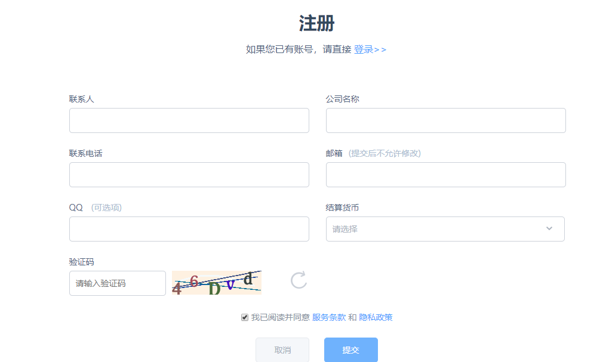
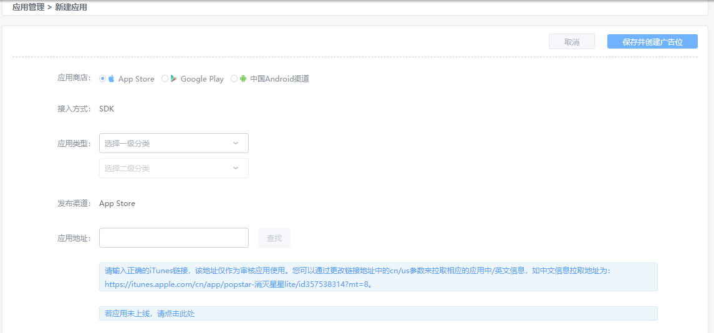
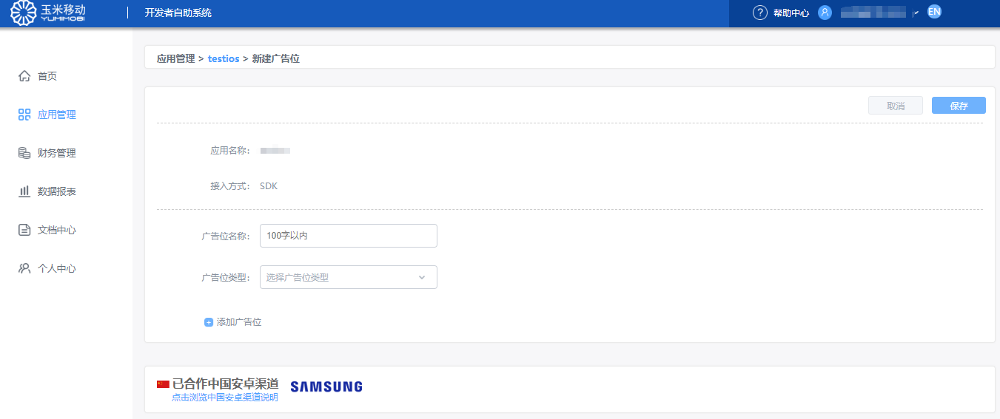
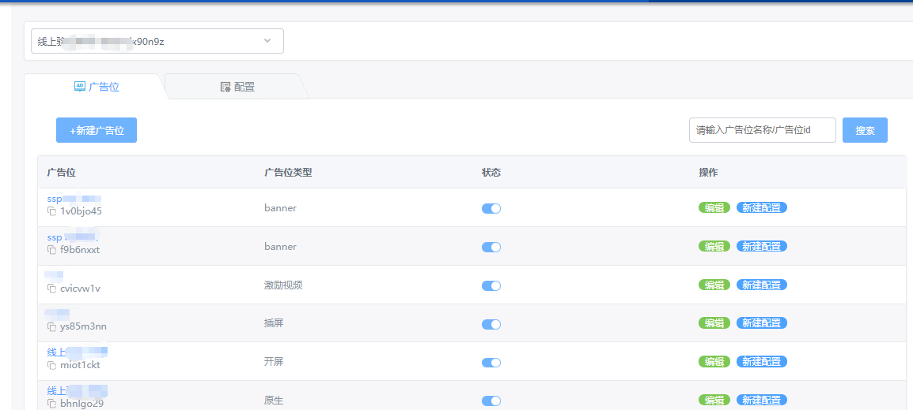
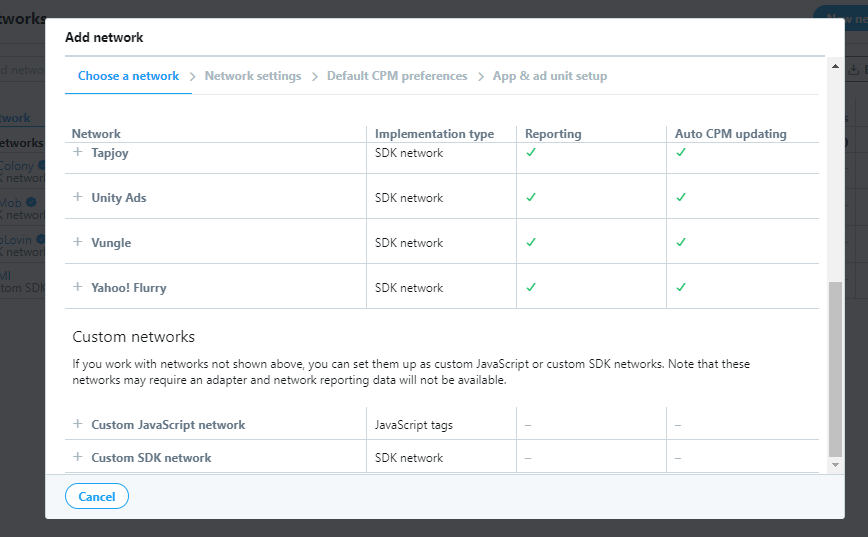
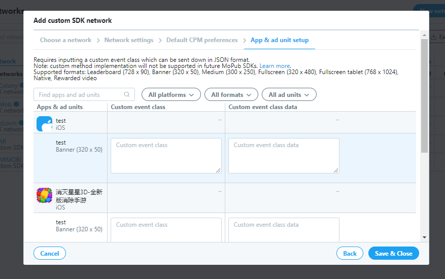
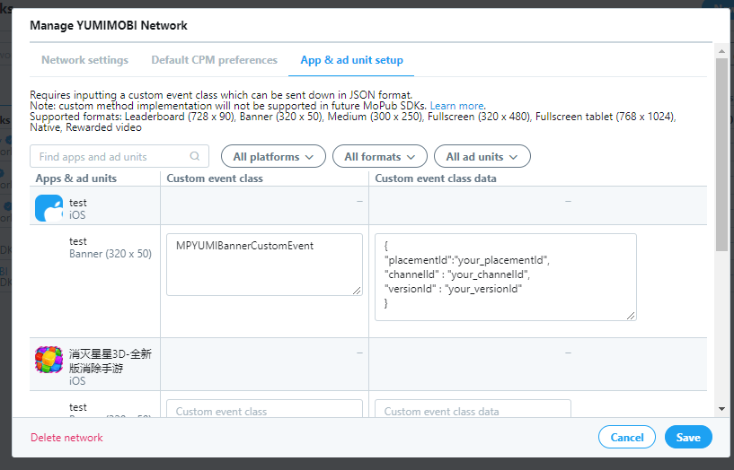
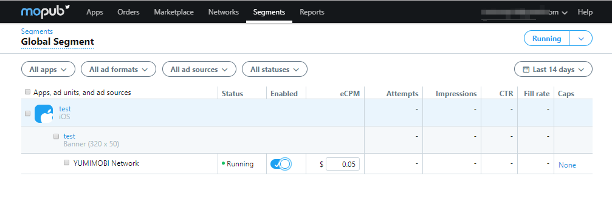

# 目录

- [目录](#%E7%9B%AE%E5%BD%95)
  - [1. 在YUMIMOBI平台申请开发者账号](#1-%E5%9C%A8yumimobi%E5%B9%B3%E5%8F%B0%E7%94%B3%E8%AF%B7%E5%BC%80%E5%8F%91%E8%80%85%E8%B4%A6%E5%8F%B7)
    - [1.1 进入YUMIMOBI平台，填写开发者基础信息并提交，等待账号审核](#11-%E8%BF%9B%E5%85%A5yumimobi%E5%B9%B3%E5%8F%B0%E5%A1%AB%E5%86%99%E5%BC%80%E5%8F%91%E8%80%85%E5%9F%BA%E7%A1%80%E4%BF%A1%E6%81%AF%E5%B9%B6%E6%8F%90%E4%BA%A4%E7%AD%89%E5%BE%85%E8%B4%A6%E5%8F%B7%E5%AE%A1%E6%A0%B8)
  - [2. 审核通过后，在YUMIMOBI平台申请应用ID及广告位ID](#2-%E5%AE%A1%E6%A0%B8%E9%80%9A%E8%BF%87%E5%90%8E%E5%9C%A8yumimobi%E5%B9%B3%E5%8F%B0%E7%94%B3%E8%AF%B7%E5%BA%94%E7%94%A8id%E5%8F%8A%E5%B9%BF%E5%91%8A%E4%BD%8Did)
    - [2.1 开发者账号审核通过后，进入应用管理页面，点击“新建应用按钮](#21-%E5%BC%80%E5%8F%91%E8%80%85%E8%B4%A6%E5%8F%B7%E5%AE%A1%E6%A0%B8%E9%80%9A%E8%BF%87%E5%90%8E%E8%BF%9B%E5%85%A5%E5%BA%94%E7%94%A8%E7%AE%A1%E7%90%86%E9%A1%B5%E9%9D%A2%E7%82%B9%E5%87%BB%E6%96%B0%E5%BB%BA%E5%BA%94%E7%94%A8%E6%8C%89%E9%92%AE)
    - [2.2 填写相关信息，点击“保存”按钮，进入创建广告位页面](#22-%E5%A1%AB%E5%86%99%E7%9B%B8%E5%85%B3%E4%BF%A1%E6%81%AF%E7%82%B9%E5%87%BB%E4%BF%9D%E5%AD%98%E6%8C%89%E9%92%AE%E8%BF%9B%E5%85%A5%E5%88%9B%E5%BB%BA%E5%B9%BF%E5%91%8A%E4%BD%8D%E9%A1%B5%E9%9D%A2)
    - [2.3 应用创建成功后，点击保存或者在应用列表页，点击应用名称进入广告位列表页点击新建广告位，创建广告位ID](#23-%E5%BA%94%E7%94%A8%E5%88%9B%E5%BB%BA%E6%88%90%E5%8A%9F%E5%90%8E%E7%82%B9%E5%87%BB%E4%BF%9D%E5%AD%98%E6%88%96%E8%80%85%E5%9C%A8%E5%BA%94%E7%94%A8%E5%88%97%E8%A1%A8%E9%A1%B5%E7%82%B9%E5%87%BB%E5%BA%94%E7%94%A8%E5%90%8D%E7%A7%B0%E8%BF%9B%E5%85%A5%E5%B9%BF%E5%91%8A%E4%BD%8D%E5%88%97%E8%A1%A8%E9%A1%B5%E7%82%B9%E5%87%BB%E6%96%B0%E5%BB%BA%E5%B9%BF%E5%91%8A%E4%BD%8D%E5%88%9B%E5%BB%BA%E5%B9%BF%E5%91%8A%E4%BD%8Did)
    - [2.4 填写广告位相关信息，点击“创建成功”按钮，返回广告位管理列表页，在广告位管理列表页，获取广告位的ID](#24-%E5%A1%AB%E5%86%99%E5%B9%BF%E5%91%8A%E4%BD%8D%E7%9B%B8%E5%85%B3%E4%BF%A1%E6%81%AF%E7%82%B9%E5%87%BB%E5%88%9B%E5%BB%BA%E6%88%90%E5%8A%9F%E6%8C%89%E9%92%AE%E8%BF%94%E5%9B%9E%E5%B9%BF%E5%91%8A%E4%BD%8D%E7%AE%A1%E7%90%86%E5%88%97%E8%A1%A8%E9%A1%B5%E5%9C%A8%E5%B9%BF%E5%91%8A%E4%BD%8D%E7%AE%A1%E7%90%86%E5%88%97%E8%A1%A8%E9%A1%B5%E8%8E%B7%E5%8F%96%E5%B9%BF%E5%91%8A%E4%BD%8D%E7%9A%84id)
  - [3. 添加MoPub SDK和YUMIMOBI SDK，步骤如下：](#3-%E6%B7%BB%E5%8A%A0mopub-sdk%E5%92%8Cyumimobi-sdk%E6%AD%A5%E9%AA%A4%E5%A6%82%E4%B8%8B)
    - [3.1 添加 MoPub SDK 和 YumiMediationSDK](#31-%E6%B7%BB%E5%8A%A0-mopub-sdk-%E5%92%8C-yumimediationsdk)
      - [3.1.1 使用 CocoaPods 集成](#311-%E4%BD%BF%E7%94%A8-cocoapods-%E9%9B%86%E6%88%90)
      - [3.1.2 手动集成 SDK](#312-%E6%89%8B%E5%8A%A8%E9%9B%86%E6%88%90-sdk)
    - [3.2 添加 Yumi adapter](#32-%E6%B7%BB%E5%8A%A0-yumi-adapter)
      - [3.2.1 Banner adapter](#321-banner-adapter)
      - [3.2.2 Interstitial adapter](#322-interstitial-adapter)
      - [3.2.3 Rewarded Video adapter](#323-rewarded-video-adapter)
    - [3.3 Demo 示例](#33-demo-%E7%A4%BA%E4%BE%8B)
  - [4. 在MoPub平台增加YUMIMOBI为新的Network平台](#4-%E5%9C%A8mopub%E5%B9%B3%E5%8F%B0%E5%A2%9E%E5%8A%A0yumimobi%E4%B8%BA%E6%96%B0%E7%9A%84network%E5%B9%B3%E5%8F%B0)
    - [4.1 进入“Networks”页面，点击“New network”按钮](#41-%E8%BF%9B%E5%85%A5networks%E9%A1%B5%E9%9D%A2%E7%82%B9%E5%87%BBnew-network%E6%8C%89%E9%92%AE)
    - [4.2 点击Custom networks-Custom SDK network链接](#42-%E7%82%B9%E5%87%BBcustom-networks-custom-sdk-network%E9%93%BE%E6%8E%A5)
    - [4.3 添加YUMIMOBI广告平台名称为YUMIMOBI Network，按照mopub步骤进入APP&ad unit setup页面，选择您要配置的APP](#43-%E6%B7%BB%E5%8A%A0yumimobi%E5%B9%BF%E5%91%8A%E5%B9%B3%E5%8F%B0%E5%90%8D%E7%A7%B0%E4%B8%BAyumimobi-network%E6%8C%89%E7%85%A7mopub%E6%AD%A5%E9%AA%A4%E8%BF%9B%E5%85%A5appad-unit-setup%E9%A1%B5%E9%9D%A2%E9%80%89%E6%8B%A9%E6%82%A8%E8%A6%81%E9%85%8D%E7%BD%AE%E7%9A%84app)
    - [4.4 选择所需配置APP后，填写Custom event class & Custom event class data参数](#44-%E9%80%89%E6%8B%A9%E6%89%80%E9%9C%80%E9%85%8D%E7%BD%AEapp%E5%90%8E%E5%A1%AB%E5%86%99custom-event-class--custom-event-class-data%E5%8F%82%E6%95%B0)
    - [4.5 点击保存创建的YUMIMOBI Network平台，确保Enabled状态开启](#45-%E7%82%B9%E5%87%BB%E4%BF%9D%E5%AD%98%E5%88%9B%E5%BB%BA%E7%9A%84yumimobi-network%E5%B9%B3%E5%8F%B0%E7%A1%AE%E4%BF%9Denabled%E7%8A%B6%E6%80%81%E5%BC%80%E5%90%AF)
  - [5. 在MoPub平台打开YUMIMOBI广告源](#5-%E5%9C%A8mopub%E5%B9%B3%E5%8F%B0%E6%89%93%E5%BC%80yumimobi%E5%B9%BF%E5%91%8A%E6%BA%90)
    - [5.1 进入“segments”页面，点击“Global Segment”链接](#51-%E8%BF%9B%E5%85%A5segments%E9%A1%B5%E9%9D%A2%E7%82%B9%E5%87%BBglobal-segment%E9%93%BE%E6%8E%A5)
    - [5.2 找到接入YUMIMOBI的应用及广告位，保障YUMIMOBI-Enabled状态为开启](#52-%E6%89%BE%E5%88%B0%E6%8E%A5%E5%85%A5yumimobi%E7%9A%84%E5%BA%94%E7%94%A8%E5%8F%8A%E5%B9%BF%E5%91%8A%E4%BD%8D%E4%BF%9D%E9%9A%9Cyumimobi-enabled%E7%8A%B6%E6%80%81%E4%B8%BA%E5%BC%80%E5%90%AF)
  - [6. 确认YUMIMOBI配置成功](#6-%E7%A1%AE%E8%AE%A4yumimobi%E9%85%8D%E7%BD%AE%E6%88%90%E5%8A%9F)
  - [7. 测试](#7-%E6%B5%8B%E8%AF%95)

## 1. 在YUMIMOBI平台申请开发者账号
### 1.1 进入[YUMIMOBI](https://ssp.yumimobi.com/#/register/)平台，填写开发者基础信息并提交，等待账号审核




## 2. 审核通过后，在YUMIMOBI平台申请应用ID及广告位ID

### 2.1 开发者账号审核通过后，进入[应用管理](https://ssp.yumimobi.com/#/app/appList/)页面，点击“新建应用按钮


### 2.2 填写相关信息，点击“保存”按钮，进入创建广告位页面

a. 若您的应用已上线，且为Google Play或者APP STORE渠道的应用，可直接填入应用链接地址获取应用信息


b. 若您未在Google Play或者APP STORE上线，或发布在非Google Play渠道，您需手动填写应用信息


### 2.3 应用创建成功后，点击保存或者在应用列表页，点击应用名称进入[广告位列表页](https://ssp.yumimobi.com/#/slot/slotList/41gqxns9/8994)点击新建广告位，创建广告位ID



### 2.4 填写广告位相关信息，点击“创建成功”按钮，返回广告位管理列表页，在广告位管理列表页，获取广告位的ID





注：您在测试中可使用如下id进行测试，测试id不会产生收益，应用上线时请使用您申请的正式id。

| 广告形式  | 广告位ID|
| ---- | -------- | 
|Banner  | l6ibkpae |
|Interstitial  | onkkeg5i  |
|Rewarded Video   | 5xmpgti4  |
|Native   | atb3ke1i  |
|Splash   | pwmf5r42 |

## 3. 添加MoPub SDK和YUMIMOBI SDK，步骤如下：

* 此部分面向 Mopub 平台聚合 YumiMediationSDK  Adapter
* Mopub 广告接入请参考 [Mopub iOS SDK 接入文档](https://developers.mopub.com/publishers/ios/getting-started/)
  
### 3.1 添加 MoPub SDK 和 YumiMediationSDK

#### 3.1.1 使用 CocoaPods 集成

如果您对 cocoapods 不熟悉，请参阅 [Cocoapods](https://guides.cocoapods.org/using/getting-started.html)

在 Podfile 文件中添加依赖项

```objective-c
source 'https://github.com/CocoaPods/Specs.git'
platform :ios, '8.0'
use_frameworks!

target 'MyApp' do
 	pod 'mopub-ios-sdk'
    pod 'YumiMediationSDK'
end 
```

然后在终端运行以下命令：

```ruby
$ pod repo update
$ pod install
```

安装完成后，在工程根目录下打开 .xcworkspace 文件：

#### 3.1.2 手动集成 SDK

Mopub，详见参考文档的手动集成方式  [Mopub文档](https://developers.mopub.com/publishers/ios/getting-started/#step-1-download-the-mopub-ios-sdk) 

YumiMediationSDK，详见参考文档的手动集成方式 [YumiMediationSDK文档](https://github.com/yumimobi/YumiMediationSDKDemo-iOS/blob/master/normalDocuments/YumiMediationSDK%20for%20iOS(zh-cn).md#%E6%8E%A5%E5%85%A5%E6%96%B9%E5%BC%8F)

### 3.2  添加 Yumi adapter

将以下文件添加到工程里面

#### 3.2.1 Banner adapter

[MPYUMIBannerCustomEvent.h](https://github.com/yumimobi/YumiMediationMopubAdDemo-iOS/blob/master/YumiMediationMopubAdDemo-iOS/Banner/MPYUMIBannerCustomEvent.h)

[MPYUMIBannerCustomEvent.m](https://github.com/yumimobi/YumiMediationMopubAdDemo-iOS/blob/master/YumiMediationMopubAdDemo-iOS/Banner/MPYUMIBannerCustomEvent.m)

#### 3.2.2 Interstitial adapter

[MPYUMIInterstitialCustomEvent.h](https://github.com/yumimobi/YumiMediationMopubAdDemo-iOS/blob/master/YumiMediationMopubAdDemo-iOS/Interstitial/MPYUMIInterstitialCustomEvent.h)

[MPYUMIInterstitialCustomEvent.m](https://github.com/yumimobi/YumiMediationMopubAdDemo-iOS/blob/master/YumiMediationMopubAdDemo-iOS/Interstitial/MPYUMIInterstitialCustomEvent.m)

#### 3.2.3 Rewarded Video adapter

[MPYUMIRewardedVideoCustomEvent.h](https://github.com/yumimobi/YumiMediationMopubAdDemo-iOS/blob/master/YumiMediationMopubAdDemo-iOS/Reward%20Video/MPYUMIRewardedVideoCustomEvent.m)

[MPYUMIRewardedVideoCustomEvent.m](https://github.com/yumimobi/YumiMediationMopubAdDemo-iOS/blob/master/YumiMediationMopubAdDemo-iOS/Reward%20Video/MPYUMIRewardedVideoCustomEvent.h)

### 3.3 Demo 示例

点击查看[Demo](https://github.com/yumimobi/YumiMediationMopubAdDemo-iOS)

> 注意：执行demo前，请在终端命令行进入工程根目录下执行
>
> ```ruby
> $ pod repo update
> $ pod install
> ```


## 4. 在[MoPub平台](https://app.mopub.com/networks)增加YUMIMOBI为新的Network平台

### 4.1 进入“Networks”页面，点击“New network”按钮



### 4.2 点击Custom networks-Custom SDK network链接


### 4.3 添加YUMIMOBI广告平台名称为YUMIMOBI Network，按照mopub步骤进入APP&ad unit setup页面，选择您要配置的APP



### 4.4 选择所需配置APP后，填写Custom event class & Custom event class data参数
以banner为例:

- a. 请在Custom event class的位置添加如下信息：

     MPYUMIBannerCustomEvent

注：(填写的是对应广告形式下Adpter class的名称)

- b. 请在Custom event class data的位置添加在YUMIMOBI广告平台申请的广告位ID,channelId&versionId的值非必填
  
{
 "placementId":"your_placementId",
"channelId" : "your_channelId",
"versionId" : "your_versionId"
}



### 4.5 点击保存创建的YUMIMOBI Network平台，确保Enabled状态开启


## 5. 在[MoPub平台](https://app.mopub.com/segments)打开YUMIMOBI广告源

### 5.1 进入“segments”页面，点击“Global Segment”链接


### 5.2 找到接入YUMIMOBI的应用及广告位，保障YUMIMOBI-Enabled状态为开启



## 6. 确认YUMIMOBI配置成功

确认步骤： **Apps->Your_App->Your_Ad_Unit_Name-> Ad source **

进入5.2 中已经打开YUMIMOB的广告位管理页面，按照以下步骤确认： **Apps->Your_App->Your_Ad_Unit_Name-> Ad source **如果成功配置，则会在[ad sources](https://app.mopub.com/ad-unit?key=5dbd7deb4bc34fc49e3ef1d4edb4a5b3)列表中会显示如下信息。如果未显示，请参照以上步骤进行检查。


## 7. 测试
您在测试中可使用如下ID进行测试，测试ID不会产生收益，应用上线时请使用您申请的正式ID。

| 广告形式  | 广告位ID|
| ---- | -------- | 
|Banner  | l6ibkpae |
|Interstitial  | onkkeg5i  |
|Rewarded Video   | 5xmpgti4  |
|Native   | atb3ke1i  |
|Splash   | pwmf5r42 |

